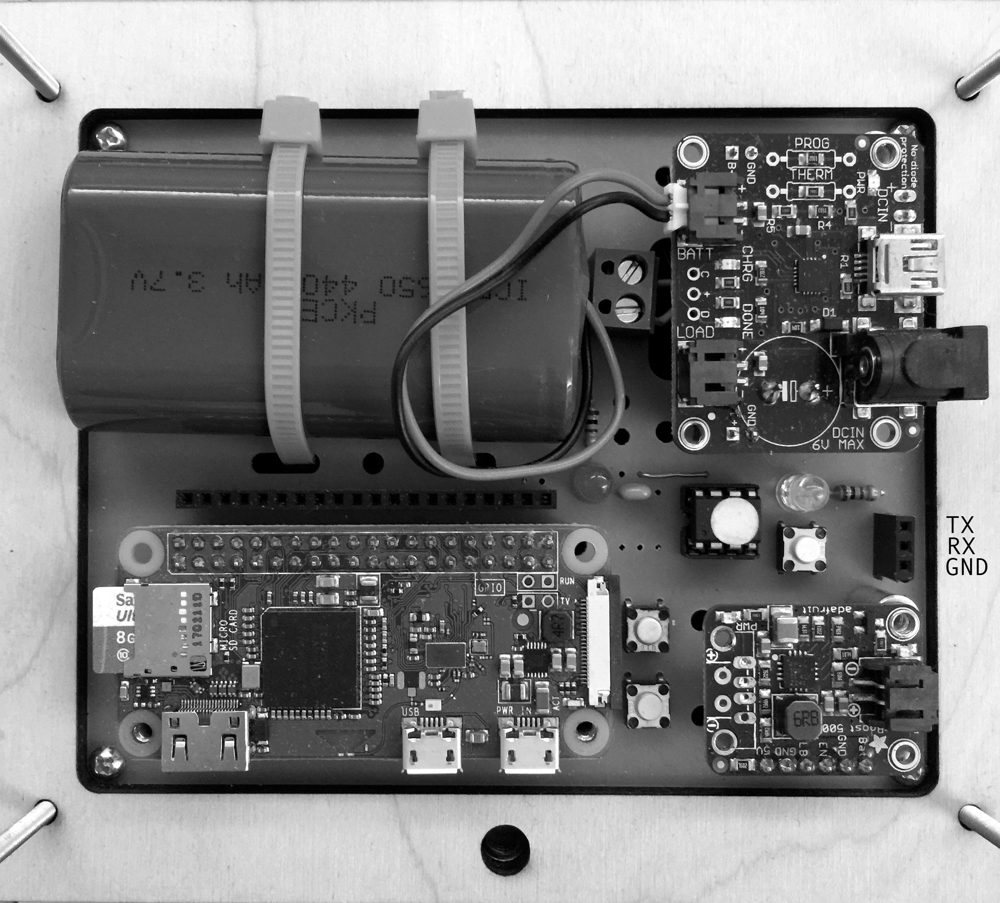

It is now possible to change the ON_ an OFF_ THRESHOLDS via a serial terminal. You need a FTDI USB<->SERIAL bridge like [this FTDI cable from Adafruit](https://www.adafruit.com/product/70)

To add this functionality, you must reprogram the ATTINY85

If you don't have a [Sparkfun Tiny ISP Programmer](https://www.sparkfun.com/products/11801)

Use an Arduino to program the ATTINY85

http://highlowtech.org/?p=1695

Afterwards, connect your FTDI cable to the RX, TX and GND pins in the image.

|WW  | FTDI|
|----|-----|
|TX  | RX|
|RX  | TX|
|GND | GND|

